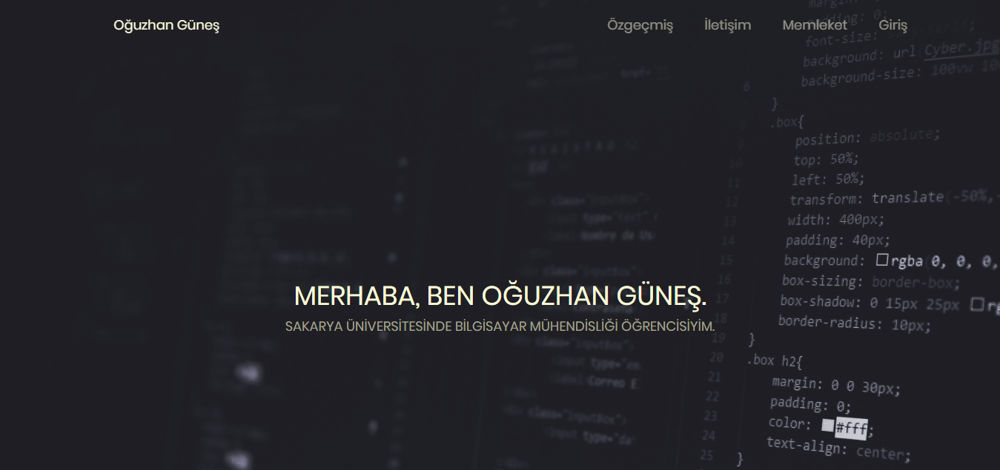
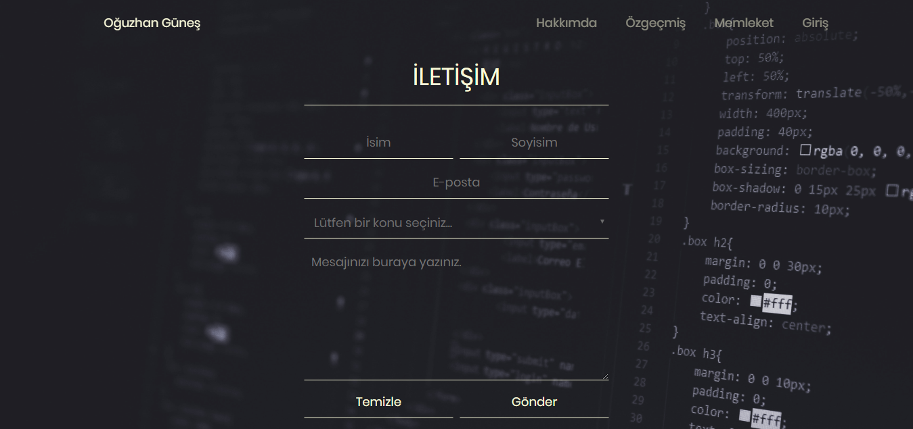
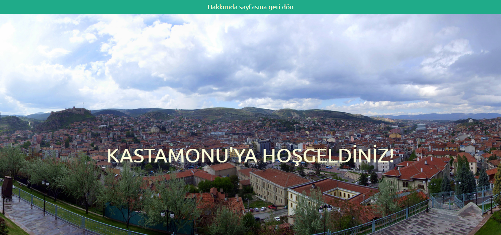
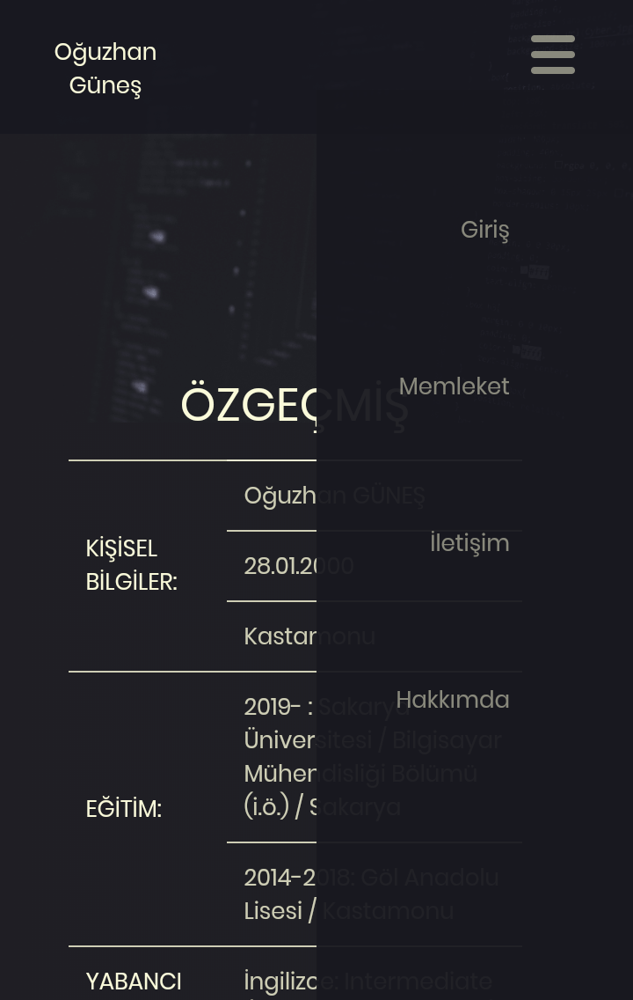

# 2019-2020 BAHAR DÖNEMİ SAKARYA ÜNİVERSİTESİ WEB TEKNOLOJİLERİ DERSİ ÖDEVİ
Bu proje G181210068 numaralı Oğuzhan GÜNEŞ'in Web Teknolojileri ödev projesidir. Proje tamamlanmıştır.  
**Öğrenci:** Oğuzhan GÜNEŞ 
**Numarası:** G181210068 
**Ders:** Web Teknolojileri 
**Ders Grubu:** 2C 
**Ödevin Konusu:** Öğrencinin kişisel ve memleketini tanıtan web sitesi uygulaması  
Taslak çizimlerine ve daha fazla bilgiye ulaşmak için [tıklayın](dokumanlar/odev_bilgi_dokumani.pdf). 
Ödev raporuna ulaşmak için [tıklayın](dokumanlar/odev_raporu.pdf).  
## PROJEDEN GÖRÜNTÜLER:
* Geniş ekran: 
  *  
  *  
   *  

* Mobil:
   *  
  *  